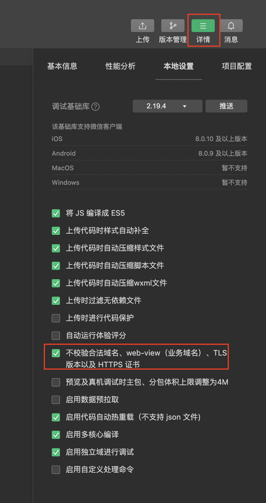
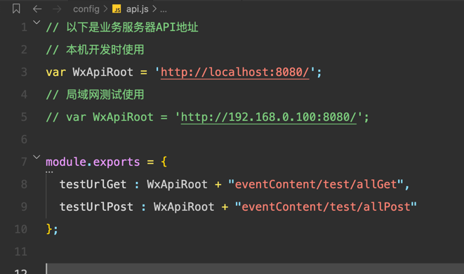

## 小程序与服务器调试教程
### 1、官方推荐方式

### 2、本地开发测试
普通情况下，wx.request命令是会校验合法域名，但是在本机开发环境下，为了方便需要勾选不校验合法域名。
这样就可以访问http://localhost:8080了。

详细可见：https://blog.csdn.net/LiHuiJUNMate/article/details/119775593

### 3、局域网模式调试
第二种方法一般是开发环境下调试，不过有时候我们需要真机调试，这个时候就可以使用局域网模式。
springboot项目正常部署，获取本机的局域网地址，然后修改api改为局域网测试使用即可

### 4、ngrok内网穿透
将本地服务通过内网穿透给外网访问，可以便于大家一起调试程序
